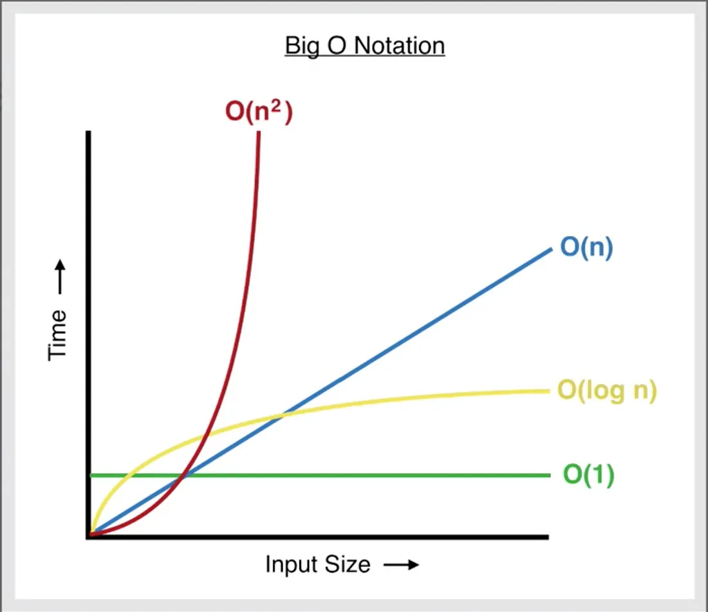

# What is *time complexity* — the tiny intuition

Think of a program operation as a recipe where each elementary step (compare, add, read/write one memory cell) takes roughly the same time. Time complexity is a way to describe **how the number of steps grows** as the input size `n` grows.

* Constant time `O(1)`: doing the same small number of steps no matter how big `n` is. Example: read element at index 3.
* Linear time `O(n)`: steps grow proportionally with `n`. Example: scan a list once to find a value.
* Quadratic `O(n²)`: steps ~ `n * n` (nested loops). Example: compare every pair in a list.
* Logarithmic `O(log n)`: halving (or similar) each step. Example: binary search.

Important: O-notation hides constant factors — it explains growth *shape*, not exact seconds.




# demo in C++ (measures times)

This small program performs three experiments on increasing `n` and prints elapsed time:

* Random access on `vector` (O(1) each).
* Insert at front on `vector` (O(n) each).
* Insert at front on `std::list` (O(1) each).

Copy, compile and run. The printed times show the growth (you can run with different `maxN` to see clearer separation).

```cpp
#include <bits/stdc++.h>
using namespace std;
using clk = chrono::high_resolution_clock;
using ns = chrono::duration<double, std::milli>;

int main() {
    ios::sync_with_stdio(false);
    cin.tie(nullptr);

    vector<int> sizes = {10000, 20000, 40000, 80000, 160000}; // adjust to machine
    cout << "n,vector_random_access_ms,vector_insert_front_ms,list_insert_front_ms\n";

    std::mt19937 rng(12345);
    for (int n : sizes) {
        // prepare data
        vector<int> v;
        v.reserve(n);
        for (int i = 0; i < n; ++i) v.push_back(i);

        // 1) random access on vector: 1,000,000 reads
        volatile int sink = 0;
        int reads = 1000000;
        uniform_int_distribution<int> dist(0, n-1);
        auto t0 = clk::now();
        for (int i = 0; i < reads; ++i) {
            int idx = dist(rng);
            sink += v[idx]; // O(1)
        }
        auto t1 = clk::now();
        double rand_access_ms = ns(t1 - t0).count();

        // 2) insert at front on vector: do m inserts into copy
        int m = min(5000, n/10 + 1); // keep it reasonable
        vector<int> vcopy = v;
        auto t2 = clk::now();
        for (int i = 0; i < m; ++i) {
            vcopy.insert(vcopy.begin(), -i); // O(n) each
        }
        auto t3 = clk::now();
        double vec_insert_front_ms = ns(t3 - t2).count();

        // 3) insert at front on std::list: do m inserts
        list<int> L(v.begin(), v.end());
        auto t4 = clk::now();
        for (int i = 0; i < m; ++i) {
            L.push_front(-i); // O(1) each
        }
        auto t5 = clk::now();
        double list_insert_front_ms = ns(t5 - t4).count();

        cout << n << ',' 
             << rand_access_ms << ',' 
             << vec_insert_front_ms << ','
             << list_insert_front_ms << '\n';
    }
    return 0;
}
```

How to run:

```
g++ -O2 list_time_demo.cpp -o list_time_demo
./list_time_demo
```

# Results

## Performance Comparison Table

| n         | vector_random_access_ms | vector_insert_front_ms | list_insert_front_ms |
|-----------|--------------------------|--------------------------|------------------------|
| 1,000,000  | 61.2972                  | 697.914                  | 0.4267                 |
| 2,000,000  | 141.693                  | 3651.35                  | 0.4157                 |
| 4,000,000  | 70.3807                  | 9102.47                  | 0.4261                 |
| 8,000,000  | 93.3926                  | 20674.4                  | 0.4251                 |
| 16,000,000 | 90.5625                  | 42028.6                  | 0.4989                 |

